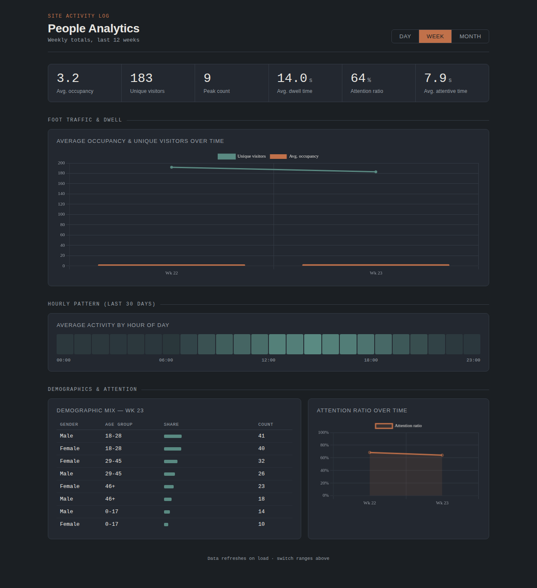
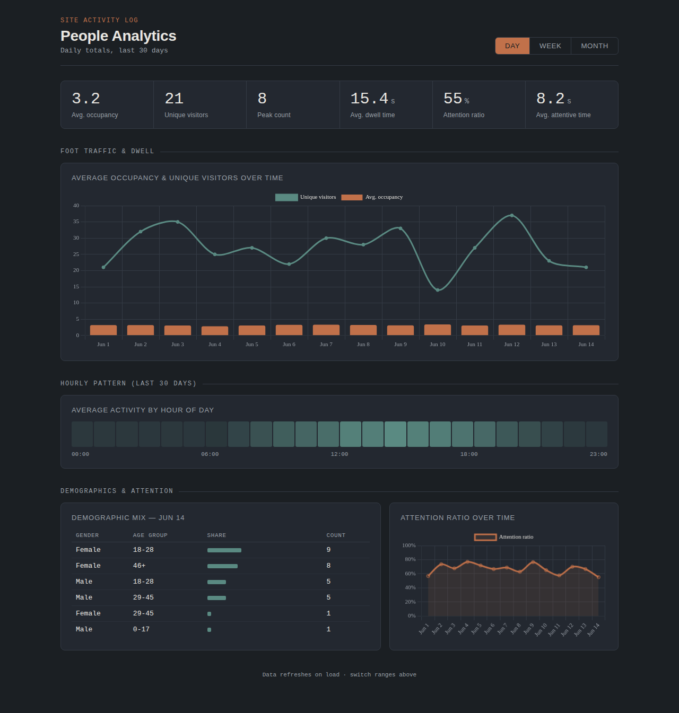
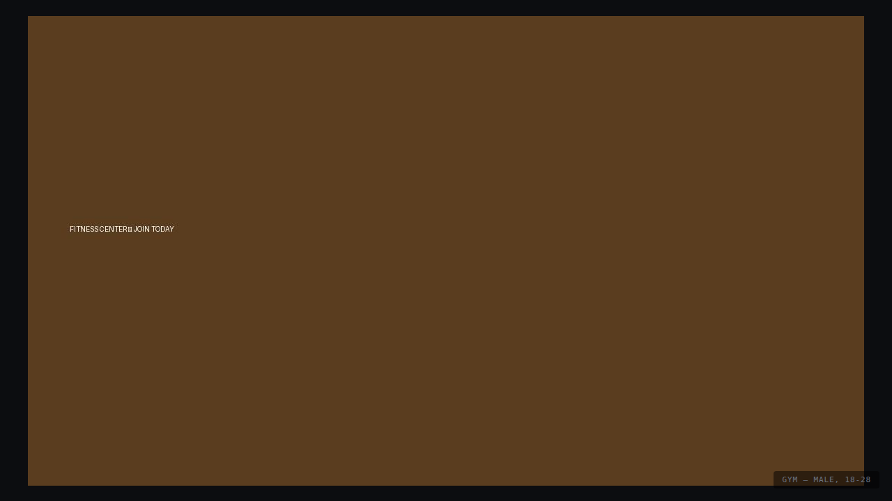

# People Analytics — Jetson Nano

A real-time people-counting and demographic analytics system for the
**Jetson Nano (4GB)**, built around two CSI cameras. It runs entirely
on-device, stores results in SQLite, and serves a local web dashboard —
no cloud services, no internet dependency.

It started as a "smart billboard" project (pick an ad based on who's
looking at it) and evolved into a general-purpose foot-traffic and
attention analytics tool that's equally useful for retail spaces,
events, offices, or anywhere you want to understand activity patterns
over time.



## What it does

- **Wide-angle camera** — detects and tracks people (YOLOv5n), counts
  foot traffic, logs unique visitors and dwell time.
- **Narrow-angle camera** — estimates age/gender, detects whether
  someone is looking at the camera (eye-cascade based "attention"
  signal), and tracks per-person attentive time.
- **Dashboard** (`:5000`) — day / week / month historical views: average
  occupancy, unique visitors, peak counts, dwell time, attention ratio,
  an hourly activity heatmap, and demographic breakdowns.
- **Ad viewer** (`:5001`, optional) — fullscreen slideshow that displays
  category-targeted content (e.g. gym / beauty / finance ads) based on
  the dominant demographic detected recently.

| Day view | Week view | Ad viewer |
|---|---|---|
|  |  |  |

## Architecture

```
                    ┌─────────────────┐         ┌──────────────────┐
  Wide-angle CSI ──▶│  scene/detector  │         │  face/analytics   │◀── Narrow-angle CSI
                    │  YOLOv5n + IoU   │         │  face detect +    │
                    │  centroid tracker│         │  age/gender +     │
                    │  dwell, traffic  │         │  eye-cascade      │
                    └────────┬─────────┘         │  attention,       │
                             │                    │  dwell, ad logic  │
                             ▼                    └─────────┬─────────┘
                    ┌──────────────────────────────────────▼─────────┐
                    │            shared/database.py (SQLite)         │
                    │  person_counts · tracking_events · face_events │
                    │  dwell_events · ad_selections                  │
                    └───────────────┬─────────────────┬──────────────┘
                                     │                  │
                                     ▼                  ▼
                       ┌─────────────────────┐  ┌────────────────────┐
                       │ dashboard/app.py     │  │ adviewer/app.py    │
                       │ Flask, port 5000     │  │ Flask, port 5001   │
                       │ historical analytics │  │ fullscreen slideshow│
                       └─────────────────────┘  └────────────────────┘
```

Each component is an independent process (`run_all.sh` launches all of
them); the only shared state is the SQLite database.

## Hardware

- Jetson Nano, 4GB
- Two CSI cameras (e.g. Raspberry Pi Camera Module 2 / IMX219), one on
  each CSI port — one wide-angle for the scene, one regular for faces
- A display is **not** required for normal operation (everything is
  accessed via the web dashboard); only needed if you enable
  `DEBUG_DRAW` for live preview windows

## Software requirements

- JetPack (tested on the JetPack 4.x line that ships Python 3.6)
- Python 3.6
- OpenCV built with CUDA DNN support (`cv2.dnn.DNN_BACKEND_CUDA`)
- PyTorch (for YOLOv5n inference)
- Flask, scipy, numpy

> **A note on JetPack compatibility:** this project was built and tuned
> against an older JetPack/Python 3.6 environment, and a lot of the
> specific choices here (GStreamer pipeline strings, `cv2.dnn` CUDA
> targets, avoiding newer library APIs) reflect what actually works on
> that combination — not necessarily the most "modern" approach. If
> you're on a newer JetPack/Python version, some of this may be
> unnecessary, but the GStreamer pipeline and CUDA DNN patterns below
> are a good starting reference regardless.

## Project layout

```
scene/      — wide-angle camera: YOLOv5n person detection + tracking
face/       — narrow-angle camera: face detection, age/gender, attention
shared/     — config, SQLite schema and query helpers
dashboard/  — Flask web dashboard (historical analytics)
adviewer/   — Flask fullscreen ad slideshow viewer
calibration/— camera calibration utilities
```

## Setup

1. Clone this repo to `~/projects/people-analytics` on the Jetson.
   (If you use a different path or username, update the
   `sys.path.insert(...)` calls at the top of each entry-point script
   and the paths in `shared/config.py` — see the
   [configuration paths](#configuration) note below.)

2. Download the model weights — these are excluded from the repo (large
   binaries). See [MODELS.md](MODELS.md) for what's needed and where to
   get it:
   - `face/models/*.caffemodel` (age/gender/face detection)
   - YOLOv5n weights for the scene detector

3. Confirm your camera sensor IDs and GStreamer pipelines work
   independently first:
   ```bash
   gst-launch-1.0 nvarguscamerasrc sensor-id=0 ! \
     'video/x-raw(memory:NVMM), width=1280, height=720, framerate=15/1' ! \
     nvvidconv flip-method=2 ! nvegltransform ! nveglglessink
   ```
   Adjust `sensor-id`, resolution, and `flip-method` for your camera
   mounting before relying on the Python pipelines in
   `scene/detector.py` / `face/analytics.py`.

4. Run calibration if needed (`calibration/calibrate.py`).

5. Start everything:
   ```bash
   ./run_all.sh
   ```
   This initializes the database, then launches the scene detector,
   face analytics, dashboard (`:5000`), and ad viewer (`:5001`).

6. Open `http://<jetson-ip>:5000` for the dashboard and
   `http://<jetson-ip>:5001` for the ad viewer.

## Configuration

All tunable settings live in `shared/config.py`. The most relevant ones:

| Setting | What it does |
|---|---|
| `SCENE_CAMERA_ID` / `FACE_CAMERA_ID` | Which CSI sensor-id is which camera |
| `DEBUG_DRAW` | `True` shows live preview windows with bounding boxes (needs a display); `False` (default) runs fully headless |
| `YOLO_WEIGHTS`, `YOLO_IMG_SIZE`, `YOLO_CONF` | Scene detector model + thresholds |
| `MIN_PERSON_W` / `MIN_PERSON_H` | Filters out detections smaller than this (tune for camera mounting height/distance) |
| `FACE_MAX_DISAPPEARED` / `FACE_MAX_DISTANCE` | Face tracker tolerance — how long/far a face can be lost before it's treated as a new person. Too low causes dwell-time fragmentation and inflated visitor counts |
| `FACE_LOG_INTERVAL` | Minimum seconds between DB writes for an unchanged face (avoids logging every frame) |
| `AD_WINDOW_SECS` | How often the ad category is re-evaluated based on recent demographics |
| `AD_POLL_SECS` / `AD_SLIDE_SECS` | Ad viewer poll interval and slideshow timing |
| `AD_CATEGORIES` | Maps `(age_group, gender)` → ad category folder name |
| `DB_PATH` | SQLite database location |

### Hardcoded paths

This project currently hardcodes absolute paths (e.g.
`/home/vision/projects/people-analytics`) in `shared/config.py` and in
`sys.path.insert(...)` calls at the top of each entry-point script
(`scene/detector.py`, `face/analytics.py`, `dashboard/app.py`,
`adviewer/app.py`). If your username or install path differs, update
these. Making this configurable via an environment variable or a single
`PROJECT_ROOT` constant is a good first contribution if you'd like to
help generalize it further.

## Data

All events — person counts, tracking sessions, face/demographic
samples, dwell times, attention durations, and ad selections — are
stored in SQLite at `data/analytics.db`. The dashboard queries this
directly; there's no separate database server. The schema
auto-migrates (adds new columns) on startup via `shared/database.py`'s
`init_db()`.

## Ad viewer content

Drop images into `adviewer/ads/<category>/` — one folder per category,
matching the values in `AD_CATEGORIES` (`gym`, `beauty_salon`,
`finance`, `lifestyle`, `gaming`, `healthcare`), plus a `default/`
folder used as a fallback when a category has no images or no ad has
been selected yet. See `adviewer/ads/README.md`.

## Troubleshooting / lessons learned

A few things that came up repeatedly while building this on an older
JetPack/Python 3.6 setup — hopefully useful if you hit the same walls:

- **`cv2.imshow` in a headless/SSH session** can fail or hang silently.
  All preview windows are gated behind `DEBUG_DRAW` for this reason —
  keep it `False` unless you're on the Jetson's physical desktop.
- **`cv2.data.haarcascades` doesn't exist on some OpenCV builds.** The
  face analytics module searches several common install paths instead
  (see `_find_cascade_file` in `face/analytics.py`) and disables the
  attention feature gracefully if the cascade file truly isn't found.
- **Two CUDA contexts (one per camera process) is the dominant RAM
  cost** on a 4GB Nano — each reserves several hundred MB regardless of
  model size. TensorRT conversion of the face/age/gender models is the
  next step if RAM is still tight after disabling debug drawing.
- **Logging every frame to SQLite** will bloat the database and SD card
  I/O fast. Face events are only logged when the smoothed
  gender/age prediction changes, or after `FACE_LOG_INTERVAL` seconds.
- **A too-aggressive tracker (`FACE_MAX_DISAPPEARED` too low)** causes
  the same person to be repeatedly re-registered as a "new" object,
  which fragments dwell time and inflates unique-visitor counts. If
  your dwell times look suspiciously short and your unique-visitor
  count looks suspiciously high, this is the first thing to check.
- **Bounding-box aspect ratio is not a reliable "facing the camera"
  signal** — a basic eye-cascade check (≥2 eyes detected) is cheap and
  noticeably more accurate for an "attention" proxy.

## Contributing

Issues and PRs welcome — particularly around:
- Generalizing the hardcoded paths (see above)
- TensorRT conversion for the face/age/gender models
- A line-crossing in/out counter for directional foot traffic
- Better tracking (ByteTrack/OC-SORT) for crowded scenes

## License

MIT — see [LICENSE](LICENSE).
